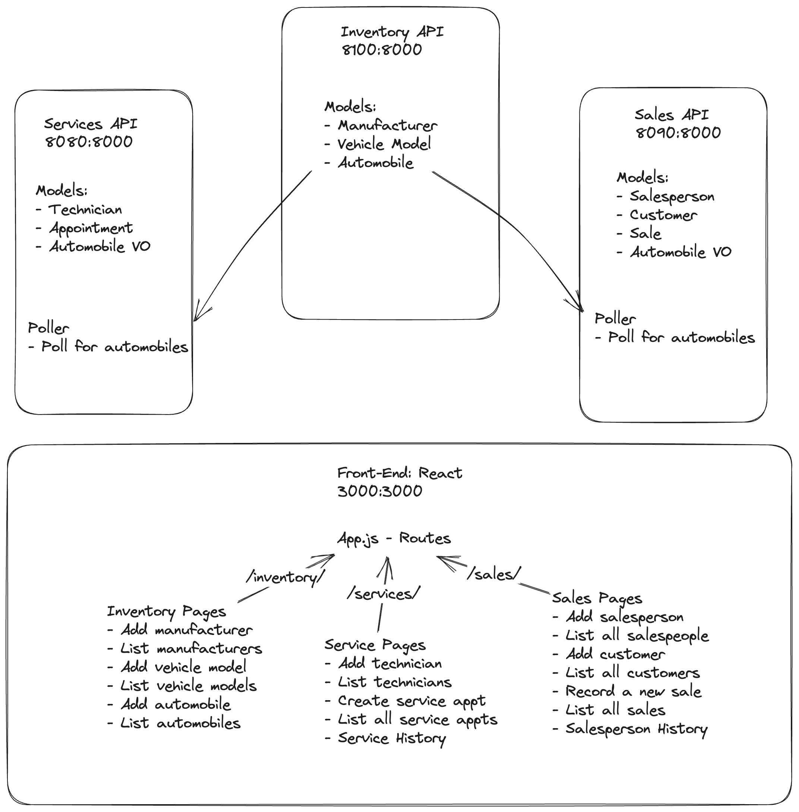

# CarCar

#### Team:

* Alexander Ho - *Car Sales feature*
* Calvin Mach - *Auto Servicing feature*

## Design

## How to Run the Project

1. Clone the repository for Project Beta at <https://gitlab.com/alexyho9/project-beta>.
2. In your terminal, change directory `cd project-beta` into the Project Beta folder.
3. Load in a new database volume `docker volume create beta-data`.
4. Build your Docker container with the command `docker-compose build`.
5. After, run container with `docker-compose up`.
6. View the page on your browser with the directory <http://localhost:3000>.

## Service microservice

### Models

- AutomobileVO (imported from Inventory API)
- Technician
- Appointments

### API

#### Technician Model
| Action | Method | URL |
| ------ | ------ | --- |
| List technicians | GET | http://localhost:8080/api/technicians/ |
| Create technician | POST | http://localhost:8080/api/technicians/ |
| Delete technician | DELETE | http://localhost:8080/api/technicians/{employee_id}/ |

Create a **technician**:

    {
        "first_name": "Bobby",
        "last_name": "Hill",
        "employee_id": "bh32"
    }

Return value of create a **technician**:

    {
	    "first_name": "Bobby",
	    "last_name": "Hill",
	    "employee_id": "bh32"
    }

Return value of all **technician** list:

    "technicians": [
        {
            "first_name": "Bobby",
            "last_name": "Hill",
            "employee_id": "bh32"
        }
    ]

#### Appointment Model

| Action | Method | URL |
| ------ | ------ | --- |
| List appointments | GET | http://localhost:8080/api/appointments/ |
| Create appointment | POST | http://localhost:8080/api/appointments/ |
| Delete appointment | DELETE | http://localhost:8080/api/appointments/:id/ |
| Set apppointment status "canceled" | PUT | http://localhost:8080/api/appointments/:id/cancel/ |
| Set apppointment status "finished" | PUT | http://localhost:8080/api/appointments/:id/finish/ |

Create an **appointment**:

    {
        "reason": "Oil Change",
        "date_time":  "2023-11-01T11:45",
        "customer": "Bert McCracken",
        "technician_id": "bh32",
	    "vin": "5FCDU97K2LA088465"
    }

Return value of create an **appointment**:

    {
        "href": "/api/appointments/1/",
        "id": 1,
        "vin": "5FCDU97K2LA088465",
        "vip": false,
        "date_time": "2023-11-01T11:45",
        "reason": "Oil Change",
        "status": "created",
        "customer": "Bert McCracken",
        "technician": {
            "first_name": "Bobby",
            "last_name": "Hill",
            "employee_id": "bh32"
        }
    }

Return value of all **appointments**:

    {
        "appointments": [
            {
                "href": "/api/appointments/1/",
                "id": 1,
                "vin": "2BCHV81S4JB533621",
                "vip": false,
                "date_time": "2023-09-23T12:15:00+00:00",
                "reason": "oil change",
                "status": "cancelled",
                "customer": "Bobby Hill",
                "technician": {
                    "first_name": "Bobby",
                    "last_name": "Hill",
                    "employee_id": "yimp"
            }
        ]
    }

Return value of a cancel/finish **appointment**:

    {
        "customer": "Bert McCracken",
        "reason": "oil change",
        "date_time": "2023-11-01T11:45",
        "status": "cancelled"
        // OR
        "status": "finished"
    }

## Sales microservice

### Models

- AutomobileVO (imported from Inventory API)
- Salesperson
- Customer
- Sale

### API

#### Salesperson Model

| Action | Method | URL |
| ------ | ------ | --- |
| List salespeople | GET | `http://localhost:8090/api/salespeople` |
| Create a salesperson | POST | `http://localhost:8090/api/salespeople` |
| Get a specific salesperson | GET | `http://localhost:8090/api/salespeople/:empid/` |
| Update a specific salesperson | PUT | `http://localhost:8090/api/salespeople/:empid/` |
| Delete a specific salesperson | DELETE | `http://localhost:8090/api/salespeople/:empid/` |

Creating or updating a **salesperson**:

    {
        "employee_id": "cdeguzman",
        "first_name": "Cory",
        "last_name": "DeGuzman"
    }

The return value of creating, getting, and updating a single **salesperson**:

    {
        "href": "/api/salespeople/cdeguzman/",
        "employee_id": "cdeguzman",
        "first_name": "Cory",
        "last_name": "DeGuzman"
    }

The list of **salespeople** is a dictionary with the key **"salespersons"** set to a list of **salespeople**.

    {
        "salespersons": [
            {
                "href": "/api/salespeople/cmach/",
                "employee_id": "cmach",
                "first_name": "Calvin",
                "last_name": "Mach"
            },
        ]
    }

#### Customer Model

| Action | Method | URL |
| ------ | ------ | --- |
| List customers | GET | `http://localhost:8090/api/customers` |
| Create a customer | POST | `http://localhost:8090/api/customers` |
| Get a specific customer | GET | `http://localhost:8090/api/customers/:pk/` |
| Update a specific customer | PUT | `http://localhost:8090/api/customers/:pk/` |
| Delete a specific customer | DELETE | `http://localhost:8090/api/customers/:pk/` |

Creating or updating a **customer**:

    {
        "first_name": "Harry",
        "last_name": "Potter",
        "address": "456 Market St, San Francisco, CA",
        "phone_number": "4156760000"
    }

The return value of creating, getting, and updating a single **salesperson**:

    {
        "href": "/api/customers/2/",
        "first_name": "Harry",
        "last_name": "Potter",
        "address": "456 Market St, San Francisco, CA",
        "phone_number": "4156760000"
    }

Getting a list of vehicle models returns a list of the detail information with the key **"customers"**.

    {
        "customers": [
            {
                "href": "/api/customers/1/",
                "id": 1,
                "first_name": "Jason",
                "last_name": "Bourne",
                "address": "555 California St, San Francisco, CA",
                "phone_number": "5553270000"
            }
        ]
    }

#### Sale Model

| Action | Method | URL |
| ------ | ------ | --- |
| List sales | GET | `http://localhost:8090/api/sales` |
| Create a sale | POST | `http://localhost:8090/api/sales` |
| Get a specific sale | GET | `http://localhost:8090/api/sales/:pk/` |
| Update a specific sale | PUT | `http://localhost:8090/api/sales/:pk/` |
| Delete a specific sale | DELETE | `http://localhost:8090/api/sales/:pk/` |

Creating or updating a sale:

    {
        "automobile_vin": "SCBCR63W55C024793",
        "salesperson_id": "cmach",
        "customer_id": 1,
        "price": 45500
    }

The return value of creating, getting, and updating a single **sale**:

    {
        "href": "/api/sales/3/",
        "automobile": {
            "vin": "SCBCR63W55C024793",
            "sold": false,
            "import_href": "/api/automobiles/SCBCR63W55C024793/"
        },
        "salesperson": {
            "href": "/api/salespeople/cmach/",
            "employee_id": "cmach",
            "first_name": "Calvin",
            "last_name": "Mach"
        },
        "customer": {
            "href": "/api/customers/1/",
            "first_name": "Jason",
            "last_name": "Bourne",
            "address": "555 California St, San Francisco, CA",
            "phone_number": "5553270000"
        },
        "price": 45500
    }

Getting a list of **sales** returns a list of the detail information with the key **"sales"**:

    {
        "sales": [
            {
                "href": "/api/sales/3/",
                "id": 3,
                "automobile": {
                    "vin": "SCBCR63W55C024793",
                    "sold": false,
                    "import_href": "/api/automobiles/SCBCR63W55C024793/"
                },
                "salesperson": {
                    "href": "/api/salespeople/cmach/",
                    "employee_id": "cmach",
                    "first_name": "Calvin",
                    "last_name": "Mach"
                },
                "customer": {
                    "href": "/api/customers/1/",
                    "id": 1,
                    "first_name": "Jason",
                    "last_name": "Bourne",
                    "address": "555 California St, San Francisco, CA",
                    "phone_number": "5553270000"
                },
                "price": 45500
            },
        ]
    }

## Inventory Services

### Model

- Manufacturer
- VehicleModel
- Automobile

#### Manufacturer Model

| Action | Methpd | URL |
| ------ | ------ | --- |
| List manufacturers | GET | http://localhost:8100/api/manufacturers/ |
| Create a manufacturer | POST | http://localhost:8100/api/manufacturers/ |
| Get a manufacturer | GET | http://localhost:8100/api/manufacturers/:id/ |
| Update a manufacturer | PUT | http://localhost:8100/api/manufacturers/:id/ |
| Delete a manufacturer | DELETE | http://localhost:8100/api/manufacturers/:id/ |

Creating and updating a manufacturer requires only the **manufacturer's** name:

    {
        "name": "Chrysler"
    }

The return value of creating, getting, and updating a single **manufacturer** is its name, href, and id.

    {
        "href": "/api/manufacturers/1/",
        "id": 1,
        "name": "Chrysler"
    }

The list of **manufacturers** is a dictionary with the key **"manufacturers"** set to a list of manufacturers.

    {
        "manufacturers": [
            {
                "href": "/api/manufacturers/1/",
                "id": 1,
                "name": "Daimler-Chrysler"
            }
        ]
    }

#### Vehicle Model

| Action | Method | URL |
| ------ | ------ | --- |
| List vehicle models | GET | http://localhost:8100/api/models/ |
| Create a vehicle model | POST | http://localhost:8100/api/models/ |
| Get a vehicle model | GET | http://localhost:8100/api/models/:id/ |
| Update a vehicle model | PUT | http://localhost:8100/api/models/:id/ |
| Delete a vehicle model | DELETE | http://localhost:8100/api/models/:id/ |

Creating a **vehicle model** requires the *model name*, a *URL* of an image, and the *id* of the manufacturer.

    {
        "name": "Sebring",
        "picture_url": "https://upload.wikimedia.org/wikipedia/commons/thumb/7/71/Chrysler_Sebring_front_20090302.jpg/320px-Chrysler_Sebring_front_20090302.jpg",
        "manufacturer_id": 1
    }

Updating a **vehicle model** can take the *name* and/or the *picture URL*. It is not possible to update a **vehicle model's** manufacturer.

    {
        "name": "Sebring",
        "picture_url": "https://upload.wikimedia.org/wikipedia/commons/thumb/7/71/Chrysler_Sebring_front_20090302.jpg/320px-Chrysler_Sebring_front_20090302.jpg"
    }

Getting the detail of a vehicle model, or the return value from creating or updating a **vehicle model**, returns the model's information and the manufacturer's information.

    {
        "href": "/api/models/1/",
        "id": 1,
        "name": "Sebring",
        "picture_url": "https://upload.wikimedia.org/wikipedia/commons/thumb/7/71/Chrysler_Sebring_front_20090302.jpg/320px-Chrysler_Sebring_front_20090302.jpg",
        "manufacturer": {
            "href": "/api/manufacturers/1/",
            "id": 1,
            "name": "Daimler-Chrysler"
        }
    }

Getting a list of **vehicle models** returns a list of the detail information with the key **"models"**.

    {
        "models": [
            {
                "href": "/api/models/1/",
                "id": 1,
                "name": "Sebring",
                "picture_url": "https://upload.wikimedia.org/wikipedia/commons/thumb/7/71/Chrysler_Sebring_front_20090302.jpg/320px-Chrysler_Sebring_front_20090302.jpg",
                "manufacturer": {
                    "href": "/api/manufacturers/1/",
                    "id": 1,
                    "name": "Daimler-Chrysler"
                }
            }
        ]
    }

#### Automobile Model

| Action | Methpd | URL |
| ------ | ------ | --- |
| List automobiles | GET | http://localhost:8100/api/automobiles/ |
| Create an automobile | POST | http://localhost:8100/api/automobiles/ |
| Get an automobile | GET | http://localhost:8100/api/automobiles/:vin/ |
| Update an automobile | PUT | http://localhost:8100/api/automobiles/:vin/ |
| Delete an automobile | DELETE | http://localhost:8100/api/automobiles/:vin/ |

You can create an **automobile** with its *color*, *year*, *VIN*, and the *id* of the *vehicle model*.

    {
        "color": "red",
        "year": 2012,
        "vin": "1C3CC5FB2AN120174",
        "model_id": 1
    }

The query of api URL uses the **VIN**. *For example*:

http://localhost:8100/api/automobiles/1C3CC5FB2AN120174/

To get the details for the car with the **VIN** "1C3CC5FB2AN120174". The details for an **automobile** include its *model* and *manufacturer*.

    {
        "href": "/api/automobiles/1C3CC5FB2AN120174/",
        "id": 1,
        "color": "yellow",
        "year": 2013,
        "vin": "1C3CC5FB2AN120174",
        "model": {
            "href": "/api/models/1/",
            "id": 1,
            "name": "Sebring",
            "picture_url": "https://upload.wikimedia.org/wikipedia/commons/thumb/7/71/Chrysler_Sebring_front_20090302.jpg/320px-Chrysler_Sebring_front_20090302.jpg",
            "manufacturer": {
            "href": "/api/manufacturers/1/",
            "id": 1,
            "name": "Daimler-Chrysler"
            }
        },
        "sold": false
    }

You can update the color, year, and sold status of an **automobile**.

    {
        "color": "red",
        "year": 2012,
        "sold": true
    }

Getting a list of **automobiles** returns a dictionary with the key *"autos"* set to a list of **automobile** information.

    {
        "autos": [
            {
            "href": "/api/automobiles/1C3CC5FB2AN120174/",
            "id": 1,
            "color": "yellow",
            "year": 2013,
            "vin": "1C3CC5FB2AN120174",
            "model": {
                "href": "/api/models/1/",
                "id": 1,
                "name": "Sebring",
                "picture_url": "https://upload.wikimedia.org/wikipedia/commons/thumb/7/71/Chrysler_Sebring_front_20090302.jpg/320px-Chrysler_Sebring_front_20090302.jpg",
                "manufacturer": {
                "href": "/api/manufacturers/1/",
                "id": 1,
                "name": "Daimler-Chrysler"
                }
            },
                "sold": false
            }
        ]
    }

### Front-end

#### Services

First step of getting started in Services is to **"Add a technician"** form which requires to fill out the *First and Last name* and then *Employee ID* which are all string form.

Ensure it has saved the change looking through the form once more when the input is cleared and upon visiting the **technician list** page and inspect for the new created variable.

Third step is the **appointment form**. The field requirement on form are the *customer name, date and time, reason*, and decide which *technician* is assigned to the *customer*. The *VIN* is optional if the customer is visiting the establishment to purchase a new car.

Ensure if it saves correctly by the form clearing the inputs and visiting the **appointment list** page and see the expected results needed.

The **appointment list** page allows function for workers to determine if the appointment is cancelled or finished with the button on far right side of the table mark as green for "finish" and red for "cancel". The *appointment* that is shown within the list is only for *appointments* *status* "created".

If the *customer* is coming back with a purchased vehicle from our establishment and makes an appointment with the same purchased VIN, then the system will update the customer to be a VIP.

Finally, on the **service history** displays all appointments regardless of status(*created, cancelled, and finished*). Shows a track record of all service appointments made(besides deleted appointments).

#### Sales

First, in order for a **sale** to happen, we need to add and register **salespeople** into the system. This can be done through the **"Add Salesperson"** page. Afterwards, we can verify that the **salesperson** has been added by clicking on the **"Salespeople"** list page.

Secondly, we need to have a registered **customer** in order to have a *sale*. We can register a **customer** using the **"Add Customer"** page. Afterwards, we can verify the **customer** has been added on the **"Customer" list** page.

Lastly, in order to record a *new sales transaction*, we visit the **"Add Sale"** page. We must select an *existing vehicle* from *inventory*, a *salesperson*, and a *customer*. A sales price should also be added, and then the sale can then be recorded with the "create" button.

After the sales transactions are recorded, we can view the **sales history** through the **"sales"** page. We can also filter the *sales done* by individual *salespeople* with the **"Salesperson History"** page.

#### Inventory

We must create a **manufacturer** first which requires the name only which sets the foundation of the build. Check if it applied the new creation by visiting the **manufacturer list**.

Create the model that requires the model build, picture url (has to be 200 character max or under) and choose the **manufacturer** that you just created. Check by visting the **Vehicle models list** if it shows.

Lastly, create the automobile that fills out additional information such as **color, year, vin** and choosing the **manufacturer**.
